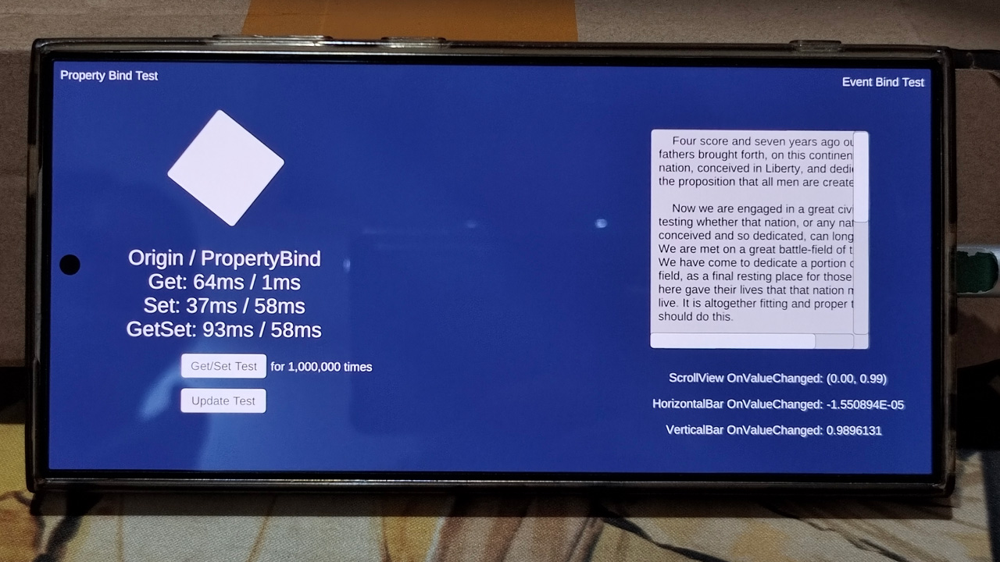

# ComponentBind
Property and Event bind of Component in Unity via reflection, fast and none gc alloc

Created with Unity 2021.3.37f1

Benchmark on Galaxy S24 Ultra:

How to use:
1. Create a view class that inherits from `BaseView` (You may change base class to your own, but don't forget modify the editor code)
2. Add `ComponentProperty` field for property bind, or `ComponentEvent` field for event bind
3. Add view class on root gameObject of your view
4. Select `GameObject` in Hierarchy，add `ComponentPropertyBinder` or `ComponentEventBinder`
5. Select field, component and property or event
6. Save.

Sample scene: `Assets/Scenes/MainScene.scene`

**If your project is working with IL2Cpp, Call `ComponentBindAOTCodeGenerator.Execute()` or click `Menu -> TooSimpleFramework -> ComponentBind -> Generate AOT Code` before build!**

Also see my blog for details (Chinese only): [基于反射实现的零GC高效率Unity组件绑定](https://www.cnblogs.com/GuyaWeiren/p/18680576.html) 

GLHF